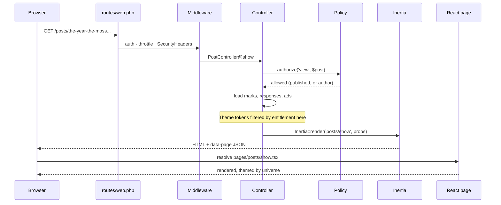
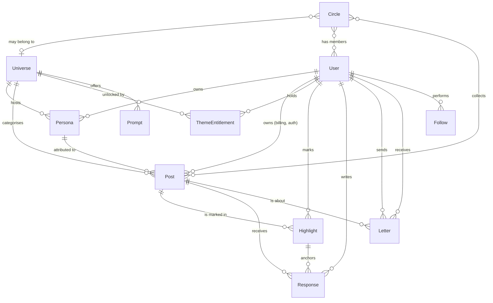
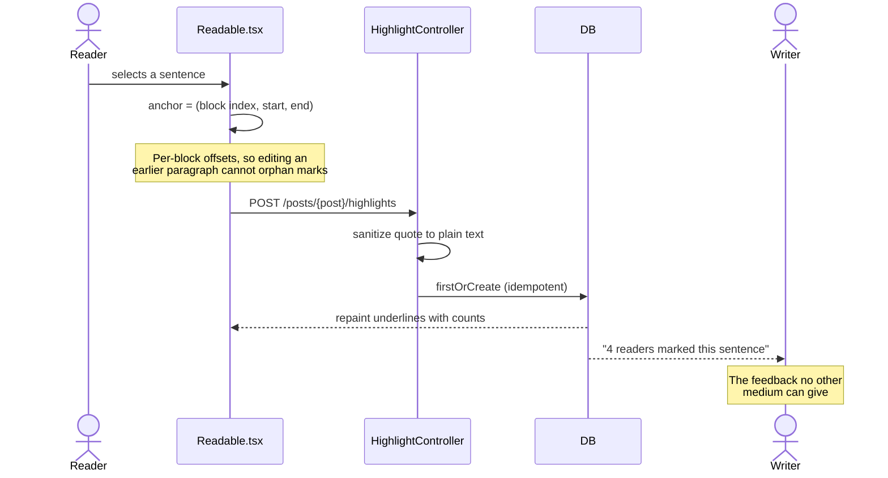

# Inkfathom

**A writing platform where every writer contains more than one person.**

> *ink* + *fathom* — to sound the depth of something, and to understand it.
> Domain: **inkfathom.com** — confirmed available at the .com registry on 18 Aug 2026. Not yet registered; verify and buy before announcing.

Each writer holds several *personas*, and each persona lives in one of six themed *universes*. The universe a piece belongs to determines how the entire interface looks while you read or write it — palette, material, texture, typography and motion, not a colour swap.

Underneath that is a product argument: **the passage is the atom, and writers quit because of silence.** Text can tell a writer exactly which sentence landed. Video cannot. Everything here is built on that. See **[STRATEGY.md](STRATEGY.md)** for the full reasoning and the features derived from it.

---

## Contents

- [Repository layout](#repository-layout)
- [Quick start](#quick-start)
- [Technology stack](#technology-stack)
- [Architecture](#architecture)
  - [Request lifecycle](#request-lifecycle)
  - [Data model](#data-model)
  - [The universe theming pipeline](#the-universe-theming-pipeline)
  - [The premium boundary](#the-premium-boundary)
  - [The highlight lifecycle](#the-highlight-lifecycle)
- [Feature tour](#feature-tour)
- [Commands](#commands)
- [Security](#security)
- [Concurrency and performance](#concurrency-and-performance)
- [Testing](#testing)
- [Known gaps](#known-gaps)
- [Credits and licence](#credits-and-licence)

---

## Repository layout

Two independent applications live here. They share no code, config, or database.

| Path | What it is | Status |
|---|---|---|
| **`platform/`** | **Inkfathom** — Laravel 12 + Inertia + React | **Active development** |
| `app/`, `resources/`, `routes/` (repo root) | The original Laravel 5.6 blog | Legacy — frozen, kept for reference |

**Work in `platform/` unless you are specifically asked to touch the legacy app.**

Orientation documents:

| File | Purpose |
|---|---|
| [STRATEGY.md](STRATEGY.md) | Why this exists. Blog vs video, and the feature set derived from it. Read before adding features. |
| [platform/CLAUDE.md](platform/CLAUDE.md) | Engineering guide for the active app. |
| [CLAUDE.md](CLAUDE.md) | Engineering guide for the legacy app, including its known latent bugs. |
| [FRONTEND_UPGRADE.md](FRONTEND_UPGRADE.md) | The original design contract for the rewrite. |
| [ROADMAP.md](ROADMAP.md) | What is built, what is left, and what was checked and found impossible. |

---

## Quick start

**Prerequisites:** PHP 8.2+, Composer, Node 18+. No database server needed — development uses SQLite.

```bash
cd platform && composer install && npm install
```

```bash
cp .env.example .env && php artisan key:generate && touch database/database.sqlite
```

```bash
php artisan migrate:fresh --seed && php artisan storage:link
```

Then start everything with one command — server, queue worker, log tailer and Vite together:

```bash
composer run dev
```

Open **http://localhost:8000**.

> **If port 8000 is already in use**, `artisan serve` silently increments to 8001, 8002, … Check the `composer run dev` output for the line it actually bound to, or pin one explicitly:
>
> ```bash
> php artisan serve --port=8080
> ```

**Demo login:** `writer@example.com` / `password` — a premium account with six personas, eight published pieces, and reader marks already on them so the core loop is visible immediately.

> Reader accounts (`ada@example.com`, `ines@example.com`, `marcus@example.com`, `wren@example.com`, `tomas@example.com`) share the same password and are on the **free** plan, which is the quickest way to see ads and the locked universes.

---

## Technology stack

| Layer | Choice | Notes |
|---|---|---|
| Framework | **Laravel 12** (PHP 8.2+) | Routing, validation, session auth, policies |
| Frontend bridge | **Inertia.js 2** | SPA behaviour with no separate API and no second auth system |
| UI | **React 19 + TypeScript** | Strict typecheck in CI-ready form |
| Styling | **Tailwind CSS 4** | Plus a hand-built metallic token layer |
| Editor | **TipTap** | Replaced the legacy CKEditor integration |
| Reading type | **Literata / Source Serif / Newsreader / Lora / Inter / Atkinson Hyperlegible** | Reader-selectable; Atkinson is the low-vision option |
| Database | **SQLite** (dev) | WAL mode; Postgres recommended for production |
| Motion | **Hand-written CSS + rAF hooks** | No animation library — see [Motion](#motion) |
| Payments | **Not wired** | `/upgrade` is a demo stub — see [Known gaps](#known-gaps) |

---

## Architecture

### Request lifecycle

Laravel keeps every web concern. React replaces only the view layer. There is no JSON API to keep in sync.



### Data model

Ownership follows the human; attribution follows the persona. That split is deliberate — retiring a voice must never destroy the work.



**Key decisions**

- `Post` carries **both** `user_id` and `persona_id`. Deleting a persona nulls `persona_id` and leaves the post with its owner.
- `follows` is polymorphic — a reader follows a *persona* or a *universe*.
- `theme_entitlements` is the source of truth for premium access, kept separate from the subscription flag so comps and grants never need a fake subscription.

### The universe theming pipeline

Token **values** live in the database, not in CSS. Adding a seventh universe is a seeder row and nothing else.

```mermaid
flowchart LR
    A[(universes.theme<br/>JSON token set)] --> B[UniverseContext::serialize]
    B -->|entitled| C[full 18-token set]
    B -->|locked| D[free Cosmos fallback<br/>+ 3-colour preview swatch]
    C --> E[Inertia props]
    D --> E
    E --> F[UniverseRoot]
    F -->|inline CSS custom properties| G["--u-bg, --u-accent,<br/>--u-metal-sheen, …"]
    G --> H[".metal · .frost · .grain<br/>.specular · .u-btn"]

    style D fill:#3a2a2a,stroke:#a55
    style C fill:#2a3a2a,stroke:#5a5
```



> **Components never branch on universe.** There is no `if (universe === 'jungle')` anywhere, and there should not be. If a component needs to know which world it is in, the theming layer is wrong.

### The premium boundary

Theme tokens ship to the browser, so the gate **must** be server-side. Gating in React would let anyone read the paid palettes out of the JS bundle and flip `data-universe` in devtools.

```mermaid
flowchart TD
    A[Request for a universe] --> B{Is it premium?}
    B -->|No| C[Send full token set]
    B -->|Yes| D{user.is_premium?}
    D -->|Yes| C
    D -->|No| E{Unexpired<br/>ThemeEntitlement?}
    E -->|Yes| C
    E -->|No| F[Send preview swatch only<br/>+ Cosmos fallback tokens]

    C --> G[Page renders in its true world]
    F --> H[Card thumbnail still faithful.<br/>Paid palette never serialized.]

    style F fill:#3a2a2a,stroke:#a55
    style C fill:#2a3a2a,stroke:#5a5
```



The same discipline applies to **ads**: an entitled reader receives `[]` from the server, so no creative is serialized at all. Paying removes ads rather than hiding them.

### The highlight lifecycle

The core interaction. A mark on a *passage*, not a like on an article.



`Post::markedPassages()` groups marks in SQL so identical passages collapse into one counted row. That count is the writer's feedback **and** the trending signal used instead of view counts — because marking costs deliberate effort and a view does not.

### Motion

`platform/resources/js/hooks/use-motion.ts` holds the primitives — no animation library is used:

| Hook | Purpose |
|---|---|
| `useReveal` | Scroll-in fade, via IntersectionObserver |
| `useParallax` | Depth drift on hero photography |
| `useScrollProgress` | Clock for scroll-driven scenes (the Deep Field) |
| `usePointerSpecular` | Highlight that follows the cursor across metal |
| `useCountUp` | Dashboard stat counters |

Two rules hold throughout:

1. **Everything degrades to the finished state under `prefers-reduced-motion`** — never to missing content. `useReveal` returns visible immediately, and CSS forces `.u-reveal` visible as a second line of defence.
2. **Scroll-driven work uses a rAF loop gated by IntersectionObserver, not `scroll` events.** Scroll events are delayed through iOS momentum scrolling and coalesced in some webviews; a frame loop reads true position every frame and costs nothing off screen.

---

## Feature tour

| Route | What it is |
|---|---|
| `/` | Landing — parallax hero in your current universe |
| `/deep-field` | **The showpiece.** One continuous zoom from the space between stars to the bottom of the sea, through all six universes |
| `/universes` · `/universes/{slug}` | Browse the worlds; each page renders in its own theme |
| `/posts` · `/posts/{slug}` | The feed, and the reading view with markable passages |
| `/circles` · `/circles/{slug}` | Community by subject, not by follower count |
| `/write` | TipTap editor, with prompts in the voice of your current universe |
| `/dashboard` | The writer's desk — **which sentences readers stopped on** |
| `/letters` | Private reader→writer notes. No audience, therefore no performance |
| `/personas` | Manage personas; switching one re-themes the whole platform |
| `/upgrade` | Pricing (demo billing — see [Known gaps](#known-gaps)) |

### The six universes

| Universe | Material | Tier |
|---|---|---|
| Cosmos | iridescent titanium | Free |
| Nature | patinated copper & verdigris | Free |
| Mountains | brushed steel & slate | Premium |
| Jungle | oxidized brass | Premium |
| Abyss | blackened chrome | Premium |
| Desert | aged bronze | Premium |

---

## Commands

All run from `platform/`.

```bash
composer run dev
```

Everything at once: server, queue, logs, Vite. The normal way to work.

```bash
php artisan test
```

A single file or filter:

```bash
php artisan test --filter=MonetizationTest
```

Reset to a known state — drops everything, re-seeds six universes, circles, prompts, demo posts and reader marks:

```bash
php artisan migrate:fresh --seed
```

Quality gates, all of which should be clean before finishing:

```bash
./vendor/bin/pint && npm run lint && npm run format && npx tsc --noEmit && npm run build
```

---

## Security

> **Development note:** the CSP allows Vite's dev-server origin only when `public/hot` exists, and reads the port from that file rather than hardcoding 5173 — Vite picks the next free port when one is taken. Without this the HMR client is blocked and the app renders blank in dev while every server-side test still passes. Covered by `AdsAndSecurityTest`.

| Concern | Handling |
|---|---|
| Stored XSS (post bodies) | `HtmlSanitizer::clean()` — tag allowlist on write. Bodies are rendered with `dangerouslySetInnerHTML`, so this is the boundary |
| Stored XSS (text fields) | `HtmlSanitizer::plain()` for responses, letters, quotes. **Not plain `strip_tags`**, which keeps tag *contents* — `<script>alert(1)</script>` survives as the visible string `alert(1)` |
| Injected script execution | CSP via `SecurityHeaders` middleware — the second line behind the sanitizer |
| Clickjacking / sniffing | `X-Frame-Options: DENY`, `frame-ancestors 'none'`, `nosniff`, `Referrer-Policy`, `Permissions-Policy`, HSTS over TLS |
| Brute force | `auth` limiter keyed by IP **and** email, so an attacker cannot lock out a real user by burning their quota |
| Spam / abuse | `prose` limiter 12/min; `marks` limiter 120/min (engaged readers genuinely mark a lot) |
| IDOR | Policies, auto-discovered by name. Cross-object references scoped in validation — a response's `highlight_id` must belong to *that* post |
| Mass assignment | `$fillable` on every model |
| Paid-content leakage | Entitlement checked server-side before serialization; asserted by `MonetizationTest` |

---

## Concurrency and performance

- **Query budgets are tested.** `QueryBudgetTest` asserts query count does not grow with row count. An N+1 under load is not a slow page — it is connection-pool exhaustion presenting as site-wide timeouts.
- **`Model::preventLazyLoading()`** is enabled outside production, so a missing eager load fails loudly in tests rather than quietly in production.
- **Universes are cached** (`Universe::cachedAll()`, invalidated by model events). They are read on every request and written approximately never.
- **SQLite is configured for concurrency**: WAL journal mode plus a 5 s busy timeout. Laravel's defaults (no WAL, zero timeout) make any two simultaneous writes fail with `database is locked`.

Verified locally: 30 concurrent requests across five routes all returned 200 in 212 ms, and 8 parallel processes × 25 writes completed with zero failures and zero lock errors.

> This makes SQLite viable for development and small deployments. It does **not** make it the right production database — use Postgres at real concurrency.

---

## Testing

```bash
php artisan test
```

**80 tests / 229 assertions**, covering:

| Suite | Covers |
|---|---|
| `PostTest` | CRUD, ownership, draft visibility, slug uniqueness, cover-image paths |
| `MonetizationTest` | Premium token gating, entitlement expiry, persona limits |
| `CommunityTest` | Highlights, responses, letters, circles, anchoring integrity |
| `AdsAndSecurityTest` | Ad gating, security headers, CSP (incl. Vite dev origin), rate limits |
| `QueryBudgetTest` | N+1 regressions |
| `HtmlSanitizerTest` | XSS payloads including obfuscated `javascript:` URLs |

---

## Known gaps

Stated plainly rather than buried.

- **SSR is not enabled.** Post content reaches the browser inside the `data-page` JSON, not as server-rendered HTML. For a blog this is the most consequential outstanding item — it needs a `resources/js/ssr.tsx` entry, `npm run build:ssr`, and a running `php artisan inertia:start-ssr`.
- **Billing is a demo stub.** `UpgradeController::activate()` flips `users.is_premium` with **no payment taken**, and disables itself the moment `services.stripe.secret` is set. Laravel Cashier is *not* installed. Wiring it means a Stripe Checkout redirect plus a webhook writing `theme_entitlements` rows — the access-control code should not need to change.
- The custom theme editor and vanity handles are advertised on `/upgrade` but not built.
- Follows are recorded but no feed is composed from them yet.
- Circles have membership and a reading list, but posts cannot yet be shared into them from the editor.

---

## Credits and licence

**Photography** — 24 photographs bundled under `platform/public/images/`, all under the [Unsplash License](https://unsplash.com/license) (free commercial use). Photographer credit is stored per universe and rendered in the UI.

> Do not add imagery from Pinterest or general web search. Those are other people's copyrighted work and are not licensed for redistribution.

**Typography** — Instrument Sans and Instrument Serif, served via Bunny Fonts.

The Laravel framework is open-sourced software licensed under the [MIT licence](https://opensource.org/licenses/MIT).
